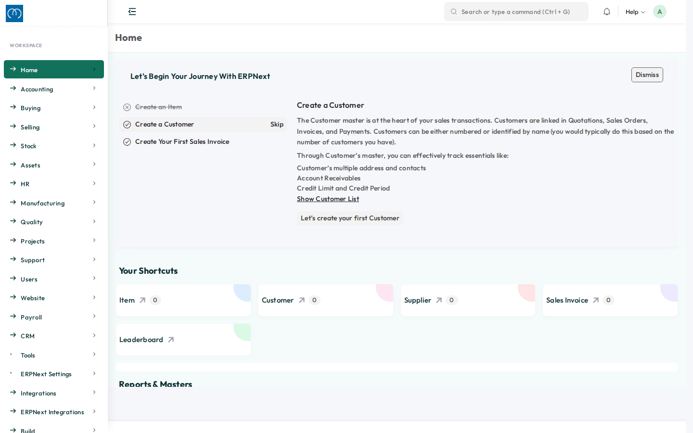
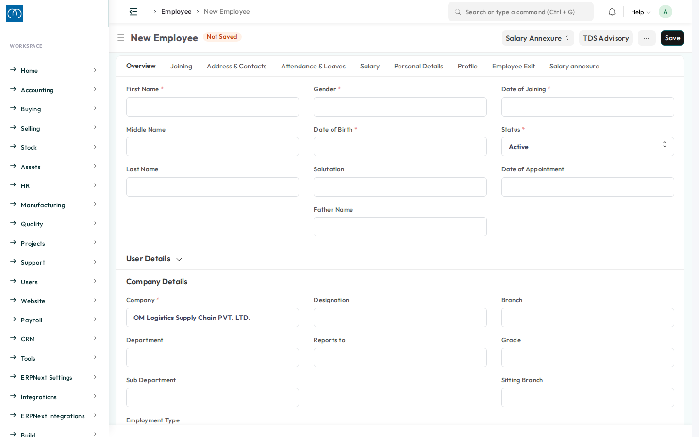

<div align="center">
  <h1>✨ Arjun Theme — ERPNext 15 Desk Theme</h1>
  <p><i>A modern glassmorphic theme for Frappe / ERPNext, forked and adapted for OM Logistics</i></p>
</div>

<hr />

## 📖 Overview

**Arjun Theme** modernizes the Frappe/ERPNext Desk experience — glassmorphism, a redesigned sidebar with animated `iconify` icons, micro-interactions, and a curated color palette.

This fork is based on [naidapa_theme](https://github.com/iammusabutt/naidapa_theme) by Dr. Codex, renamed and adapted for OM Logistics, with one deliberate behavior change: **the login page is excluded from this theme**, so it never overrides a site's own custom login page (see [Login page exclusion](#-login-page-exclusion) below).

**Desk home**


**Form view**


## 🚀 Features

- **Modern Layouts & Glassmorphism:** Clean, soft translucency combined with tuned drop shadows.
- **Dynamic Workspaces:** Fully responsive sidebar with customizable animated `iconify` icons.
- **Micro-Interactions:** Subtle hover states and polished widget cards.
- **Custom Color Palette:** Curated tones for a modern, cohesive Desk look.

## 🔒 Login page exclusion

Upstream `naidapa_theme` ships its own `www/login.html` + `login.py` and site-wide `web_include_css`/`web_include_js` rules that restyle the login page along with the rest of the site. This fork removes that entirely:

- No `www/login.html` / `login.py` — the login route is never overridden, so another app's custom login page (or Frappe's default) always renders untouched.
- The remaining global CSS rules (`body`, `a`, `.alert`) are scoped with `:not([data-path="login"])`.
- The portal JS (`arjun_portal.js`) returns immediately on any `/login` path, before any DOM changes.

Desk theming (`app_include_css`/`app_include_js` — sidebar, navbar, forms, calendar, icons) is untouched from upstream. Only what the web-page hooks reach was changed.

## 🛠️ Installation

```bash
cd frappe-bench
bench get-app https://github.com/arjunolsc/arjun_theme.git
bench --site <sitename> install-app arjun_theme
bench build --app arjun_theme
```

## 🙏 Credit

Original theme by **Dr. Codex** — [www.drcodex.com](https://www.drcodex.com). This fork is maintained internally for OM Logistics; please direct upstream feature requests to the original project.

## 🧑‍💻 Contributing

This app uses `pre-commit` for code formatting and linting. Please [install pre-commit](https://pre-commit.com/#installation) and enable it for this repository:

```bash
cd apps/arjun_theme
pre-commit install
```

Pre-commit is configured to use the following tools for checking and formatting your code:
- `ruff`
- `eslint`
- `prettier`
- `pyupgrade`

## 📄 License

This software is released under the **MIT** License.
